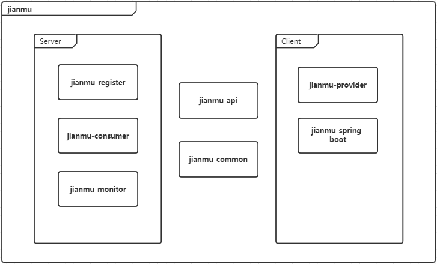

# jianmu-taskengine

### 介绍
建木分布式任务调度引擎

### 软件架构

#### 整体架构

基于C/S模型，建木项目分为服务端、客户端、通用模块三部分：

#### 服务端

为项目架构中的服务调用方（consumer）。当任务被提交时，流调系统会将依据特定的负载均衡算法将任务分配到可用、健康的已注册的客户端（provider）中，并持续对任务进度进行监听管理。

- jianmu-register - 注册中心
- jianmu-comsumer - 任务提交模块
- jianmu-monitor - 任务监控模块

#### 客户端

客户端实际为项目架构中的服务提供方（provider）。当客户端接收到服务端（consumer）提交的任务时，将根据特定的规则进行执行并持续向服务端回调任务执行的进度等信息。

- jianmu-provider - 任务执行模块
- Jianmu-spring-boot - SpringBoot集成支持

#### 通用模块

通用模块部分包含项目的通用接口与实体对象，工厂类等公共类，由如下两模块组成

- jianmu-api - 通用接口
- jianmu-common - 公共类模块
