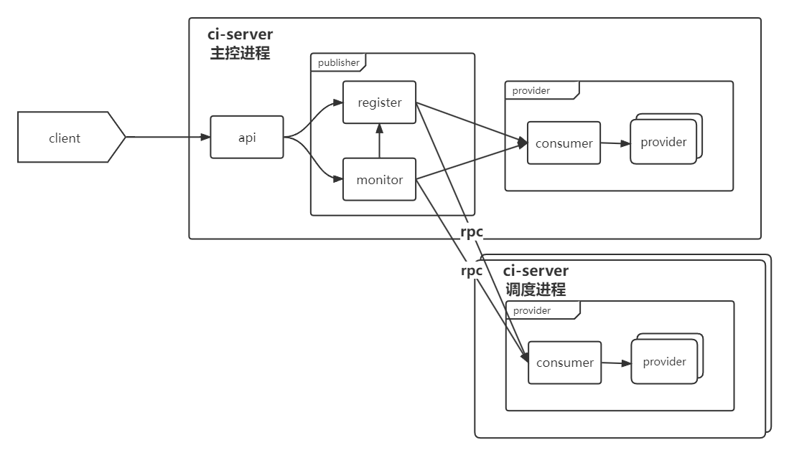

# jianmu-taskengine

### 介绍
- 建木分布式任务调度引擎

- GLCC介绍： https://www.gitlink.org.cn/glcc

- 课题介绍： https://v8zrmetkbg.feishu.cn/wiki/wikcnArzBZWw8QUihDuB0TorUGe

#### 整体架构

**任务引擎架构图**



**任务提交流程图**


#### 包结构

- [api](api) - 通用接口
- [doc](doc) - 相关文档
- [provider-provider](provider-provider) - 服务提供模块
- [publish-consumer](publish-consumer) - 任务提交模块
- [publish-monitor](publish-monitor) - 任务监控模块
- [publish-register](publish-register) - 注册中心模块
- [rpc](rpc) - rpc组件

#### 接口文档

[点击跳转](/doc/api.md)

### 使用

#### 运行环境

- JDK 11 及以上
- MySQL 8.0及以上

#### 构建

```
mvn package
```
